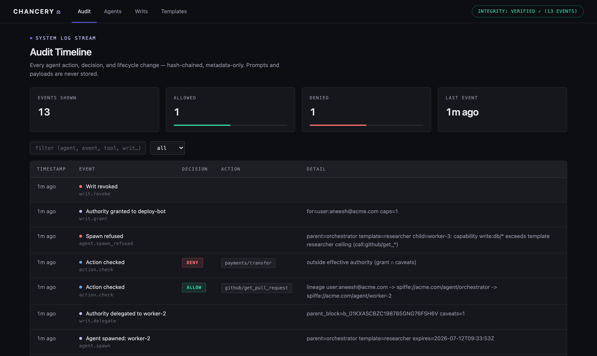
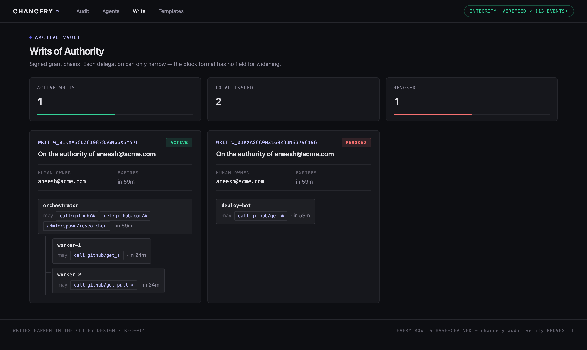

# Chancery

**The identity provider for AI agents** — the neutral, self-hosted system
of record for what every agent is, who it acts for, what it can do, and
what it has done.

Agents get their identities from Chancery, their credentials through it
(never holding real secrets), and every action attributed by it — by
construction, not log forensics. In-path enforcement: register, scope,
delegate, revoke — instantly, at the identity or instance level. Audit is
metadata-only as a structural invariant: prompts and payloads are never
stored.

Single Go binary. Apache-2.0. MCP-first, then HTTP, shell, browser.
Try the 60-second story: `make demo`.

**What you get today:**

- **Identity** — agent → immutable version → revocable instance;
  SPIFFE-compatible URIs; registry-born, owner-attributed (RFC-001)
- **Writs** — delegated authority that can only narrow: the block
  format has no field for widening (RFC-002)
- **In-path enforcement** — `mcp wrap` checks every tool call against
  fresh state; revocation lands on the *next call*, not the next
  token expiry (RFC-005/007)
- **Sealed credentials** — injected into the tool server's env, never
  the agent's context; prompt injection can't leak what was never
  there (RFC-003)
- **Runtime spawn** — orchestrators mint governed workers without the
  admin token, bounded by human-locked templates (RFC-012)
- **Browser sessions** — custodied cookies + per-URL navigation
  scoping (RFC-013)
- **Callee trust** — server pinning with drift refusal, frozen
  tree-pinned installs, and OS-level confinement (RFC-016/018)
- **Per-call semantics** — task-bound grants, a pluggable intent
  checker, capability leases, admitted-vs-committed audit
  (RFC-015/017)
- **Tamper-evident audit** — hash-chained, metadata-only by schema;
  plus a read-only dashboard at `/ui` (RFC-006/014)


**MCP-first, not MCP-only.** The registry, writs/delegation, policy,
sealed credentials, and audit govern *any* agent in any language today
(LangGraph, CrewAI, a cron job, a shell script) via the decision API —
see [Governing any agent](docs/governing-any-agent.md). What's MCP-
specific today is the *unbypassable, in-path* enforcement (`mcp wrap`);
for other runtimes you use advisory checks now and switch to in-path
enforcement as those PEPs land (HTTP → shell → browser), with the same
writs.

**Two promises** ([RFC-011](rfcs/011-open-core-boundary.md)): what
ships open source stays Apache-2.0 — no license flip, ever; and
security is never paywalled — every gap in [SECURITY.md](SECURITY.md)
closes in the open core. The boundary test: whatever makes a single
trust domain secure and operable is open source; value that exists
only at organizational scale (SSO/SCIM, multi-tenancy, SIEM exporters,
compliance packs, HA orchestration) is enterprise.

## Install

```sh
brew install chanceryhq/tap/chancery          # macOS / Linux
# or: docker run --rm -v chancery:/data ghcr.io/chanceryhq/chancery --help
# or: download a signed binary from the Releases page
# or from source:
go build -o chancery ./cmd/chancery
```

Release binaries and checksums are cosign-signed (keyless, via GitHub
OIDC) and ship with an SBOM; verification instructions are in each
release's notes.

## Try it (pre-alpha)

```sh
./chancery init --trust-domain acme.com
./chancery agent register deploy-bot --owner user:you@acme.com \
    --purpose "deploys services" --prompt ./prompt.md --model claude-fable-5
./chancery writ grant --for user:you@acme.com --to deploy-bot --cap "call:github/*"
./chancery writ delegate <writ-id> --to test-runner --caveat "call:github/get_*"
./chancery writ check <writ-id> --resource github/get_pull_request   # ALLOW + lineage
./chancery writ revoke <writ-id>
./chancery writ check <writ-id> --resource github/get_pull_request   # DENY: revoked
./chancery audit                                                     # the timeline
```

Every action is attributed to a specific agent, version, and delegation
chain — and a delegated writ can only ever narrow: the block format has
no field for widening.

### Spawn agents at runtime — governed, no admin token

Orchestrators that **create agents at runtime** don't need the admin
token: spawning is itself writ-governed
([RFC-012](rfcs/012-dynamic-agent-creation.md)). A human locks a
template (capability ceiling + max lifetime) once; the orchestrator's
writ carries `admin:spawn/<template>`; every spawned worker is
registered, delegated a narrowed block, owner-attributed, and expires
on its own:

```sh
./chancery template create researcher --purpose "reads github" \
    --max-cap "call:github/get_*" --max-ttl 30m
./chancery writ grant --for user:you@acme.com --to orchestrator \
    --cap "call:github/*" --cap "admin:spawn/researcher"
./chancery agent spawn worker-1 --writ <writ-id> --agent orchestrator \
    --template researcher --ttl 10m      # or POST /v1/spawn — no admin token
```

### Enforce it live on any stdio MCP server

Per-call policy, sealed secrets injected server-side only, revocation
on the next call:

```sh
./chancery secret put github-token --from-file ./token
./chancery mcp wrap --agent deploy-bot --writ <writ-id> \
    --secret GITHUB_TOKEN=github-token -- npx @yourorg/some-mcp-server
```

### Browser agents: custodied sessions, scoped navigation

The human's session is sealed and custodied — the agent never holds a
cookie — and granting `net:…` capabilities scopes every navigation
per-URL, in-path, fail-closed
([RFC-013](rfcs/013-browser-sessions-and-tokens.md)):

```sh
./chancery secret put github-session --from-file storage-state.json
./chancery writ grant --for user:you@acme.com --to web-bot \
    --cap "call:browser/*" --cap "net:github.com/*"
./chancery mcp wrap --agent web-bot --writ <writ-id> \
    --secret-file STATE=github-session \
    -- npx @playwright/mcp@latest --isolated --storage-state=chancery-file:STATE
# github.com/* navigations pass; mail.google.com is a -32001 denial;
# instance revoke is the session kill switch. See examples/browser-agent.
```

### Trust the server, not just the agent

Permission is about the caller; the gate also verifies the **callee**.
The first wrap **pins** the server's identity and every later wrap
refuses on drift ([RFC-016](rfcs/016-server-pinning.md)) — three
tiers, strongest wins: an `image@sha256:…` digest in the command, a
whole directory tree via `--pin-tree`, or the binary's hash by
default. Better: skip `npx` entirely
([RFC-018](rfcs/018-frozen-installs-and-confinement.md)) —

```sh
./chancery mcp install @yourorg/some-mcp-server@1.4.2 \
    --egress api.github.com --writable /tmp/agent-scratch
# frozen install, lifecycle scripts disabled, whole tree Merkle-pinned;
# mutable specs (latest, ^, ~) refused — a mutable reference is not an identity.
# Poison ONE file in it and the next wrap refuses to start.
```

and turn the pin's manifest into an **OS boundary** with `--confine`:
outbound network goes loopback-only through an auditing egress
allow-list proxy (off-manifest hosts are a 403 +
`mcp.server_egress_denied` — host recorded, never paths), and the
filesystem is read-only outside the declared writable paths. Where the
sandbox layer is missing, the spawn **refuses** — never silently
unconfined. Upgrades and manifest changes go through
`chancery mcp repin`: explicit, audited. And
`mcp wrap --dry-run` preflights all of it — effective authority, pin
status, manifest — spawning nothing, pinning nothing.

### Beyond capabilities: the task, the moment, the commit

Capabilities say what's *allowed*; three per-call mechanisms narrow
that to what's *intended* and record what *happened*:

```sh
./chancery writ grant --for user:you@acme.com --to db-bot \
    --cap "call:db/*" --task "read this week's metrics"
./chancery mcp wrap --agent db-bot --writ <writ-id> \
    --intent-check ./checker.sh --lease -- <db-mcp-server>
```

- **Task-bound grants** ([RFC-017](rfcs/017-intent-socket.md)):
  `--task` writes the grant's *purpose* onto the writ — audited, and
  handed to intent checkers as the one thing they can't infer.
- **The intent socket** (RFC-017): plug any external detector into the
  per-call decision. It sees `{agent, task, tool, args}` and votes —
  veto-only (it can never widen), fail-closed in `enforce`, log-only
  in `advise`, arguments never stored. Chancery ships no semantic
  judgment; it makes yours enforceable.
- **Capability leases**
  ([RFC-015](rfcs/015-call-lifecycle-and-leases.md)): `--lease` stamps
  each admitted call with a 30-second signed lease a cooperating
  server verifies (`POST /v1/leases/verify`) right before committing —
  a revocation landing mid-flight fails at the server instead of
  landing. Either way the trail records `mcp.call_result`: "allowed"
  and "happened" are different facts.

### The control plane: API + read-only dashboard

Run the control plane as an HTTP API with `./chancery serve`
(REST/JSON under `/v1`; the admin token is printed once at `init`) —
and open **http://127.0.0.1:7423/ui** for the embedded **read-only
dashboard** ([RFC-014](rfcs/014-read-only-dashboard.md)): the live
audit timeline with a permanent integrity badge, the agent roster
with spawn provenance, and the delegation tree rendered as a tree.
Writes (grant, revoke, seal) deliberately stay in the CLI/API.
The audit timeline is hash-chained — `./chancery audit verify` detects
any edit, deletion, or reorder. Known MVP gaps are published in
[RFC-009 §5](rfcs/009-threat-model.md).





## Guides

- [**Quickstart (MCP)**](QUICKSTART.md) — govern the real filesystem MCP server in 5 minutes
- [**Governing any agent**](docs/governing-any-agent.md) — the non-MCP path: identity, policy, revocation, audit for any job in any language
- [**Testing playbook**](docs/testing-playbook.md) — one guided ~20-minute run through every feature (001–018), with expected output at each step
- [**Verify every claim yourself**](docs/verify.md) — hands-on, by-hand checks that each RFC does what it says
- [Concepts](docs/concepts.md) — agent, version, instance, writ
- [**Browser agents**](examples/browser-agent/README.md) — custodied sessions + scoped navigation for Playwright MCP
- [Claude Code / MCP client setup](examples/claude-code/README.md) — the `.mcp.json` drop-in
- [**Perseus Vault**](examples/perseus-vault/README.md) — provable authority + provable content: reader/writer writs for a crypto-chained memory store
- [Go SDK](sdk/) and [example agent](examples/go-agent/) — advisory in-process checks over the API
- [LangGraph / Python agents](examples/langgraph/README.md) — the deployment-shaped integration

The SDK is **advisory** — a client-side convenience. The enforcement
boundary is always the out-of-process proxy (`chancery mcp wrap`), which
a prompt-injected agent cannot talk its way around.

## Build & test from source

```sh
git clone https://github.com/chanceryhq/chancery && cd chancery
make build      # -> ./chancery  (Go 1.26+, no CGO, single static binary)
make test       # go vet + 105 tests across 11 packages, in seconds
make demo       # the 60-second enforcement + audit arc, end to end
```

See [CONTRIBUTING.md](CONTRIBUTING.md) for the repo layout, how the tests
map to each RFC, and how to propose changes.

## Design RFCs

Design happens as a series of locked decisions, one RFC at a time
([template](rfcs/TEMPLATE.md)).

| RFC | Title | Status |
|-----|-------|--------|
| [000](rfcs/000-vision-and-plan.md) | Vision and plan | In Review |
| [001](rfcs/001-agent-identity-model.md) | Agent identity model | In Review |
| [002](rfcs/002-lineage-and-delegation.md) | Lineage and delegation | In Review |
| [003](rfcs/003-credential-broker.md) | Credential broker | In Review |
| [004](rfcs/004-policy-and-authorization.md) | Policy and authorization | In Review |
| [005](rfcs/005-runtime-enforcement.md) | Runtime enforcement (MCP → HTTP → shell → browser) | In Review |
| [006](rfcs/006-audit-and-attribution.md) | Audit and attribution | In Review |
| [007](rfcs/007-lifecycle-and-revocation.md) | Lifecycle and revocation | In Review |
| [008](rfcs/008-data-model-and-apis.md) | Data model and APIs | In Review |
| [009](rfcs/009-threat-model.md) | Threat model | In Review |
| [010](rfcs/010-mvp-scope.md) | MVP scope (the 90-day build) | In Review |
| [011](rfcs/011-open-core-boundary.md) | Open-core boundary | In Review |
| [012](rfcs/012-dynamic-agent-creation.md) | Dynamic agent creation (writ-gated runtime spawn) | In Review |
| [013](rfcs/013-browser-sessions-and-tokens.md) | Browser sessions and tokens as governed credentials | In Review |
| [014](rfcs/014-read-only-dashboard.md) | Read-only dashboard (`/ui`) | In Review |
| [015](rfcs/015-call-lifecycle-and-leases.md) | Call lifecycle and capability leases | In Review |
| [016](rfcs/016-server-pinning.md) | Server pinning (callee identity: binary, tree, digest) | In Review |
| [017](rfcs/017-intent-socket.md) | Task-bound grants and the intent socket | In Review |
| [018](rfcs/018-frozen-installs-and-confinement.md) | Frozen installs and manifest-bounded confinement | In Review |
