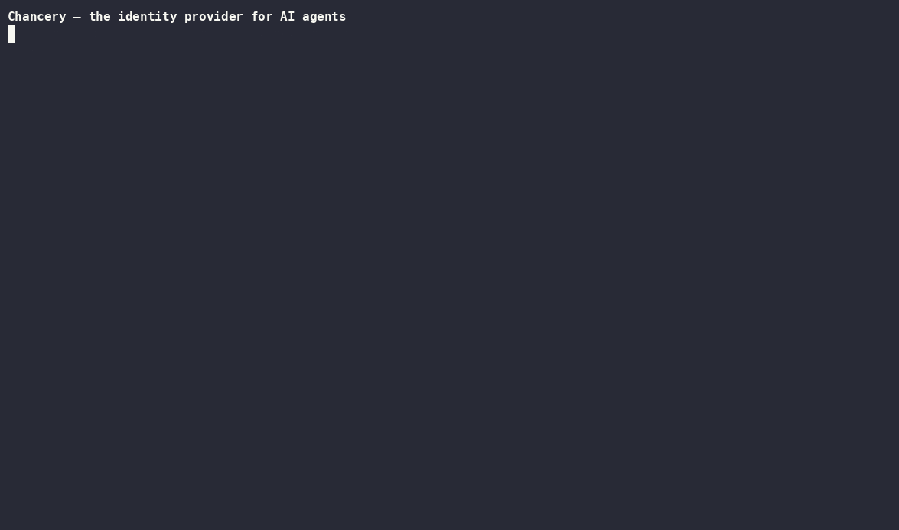

<h1>Chancery</h1>

**The identity provider for AI agents.** Every agent gets its own
identity, authority that can only narrow when delegated, revocation
that lands on its *next* action, and an audit trail it cannot write to.

Self-hosted. Single Go binary. Apache-2.0.
[chanceryai.vercel.app](https://chanceryai.vercel.app/)



## Why

Agents usually run on a shared API key, so you can't revoke one without
breaking the rest and can't attribute an action to a specific agent. A
prompt injection then isn't bad output — it drives every tool that key
can reach. And the logs come from the agent itself, the one component
you stopped trusting the moment it was compromised.

Chancery moves all three outside the agent: identity it doesn't mint,
authority it can't widen, and a record it can't write.

## Install

```sh
brew install chanceryhq/tap/chancery          # macOS / Linux
# or: docker run --rm -v chancery:/data ghcr.io/chanceryhq/chancery --help
# or: go build -o chancery ./cmd/chancery
```

Binaries are cosign-signed (keyless, GitHub OIDC) and ship an SBOM.

## Try it

```sh
chancery init --trust-domain acme.com
chancery agent register deploy-bot --owner user:you@acme.com --purpose "deploys services"
chancery writ grant --for user:you@acme.com --to deploy-bot --cap "call:github/get_*" --ttl 8h

# run a real MCP server behind the gate, with a sealed token
chancery secret put github-token --from-file ./token
chancery mcp wrap --agent deploy-bot --writ <writ-id> \
    --secret GITHUB_TOKEN=github-token -- npx @acme/github-mcp
#   get_pull_request → ALLOW      forwarded, attributed, recorded
#   delete_repo      → DENY       never reaches the server

chancery writ revoke <writ-id>    # the agent's NEXT call fails, mid-session
chancery audit                    # the timeline; `audit verify` checks the chain
```

Full walkthrough: [**QUICKSTART**](QUICKSTART.md) · try every feature in
order: [**testing playbook**](docs/testing-playbook.md).

## What it does

- **Identity** — agent → immutable content-addressed version → revocable
  running instance, each separately killable, all owner-attributed.
- **Writs** — authority as a signed chain that can only add restrictions.
  Widening isn't forbidden, it's *unrepresentable*: the delegation block
  format has no field for it.
- **In-path enforcement** — `mcp wrap` decides every tool call against
  fresh state, filters `tools/list`, and answers denials in-protocol. A
  prompt-injected agent can't talk its way around an out-of-process proxy.
- **Sealed credentials** — injected into the *tool server's* environment,
  never the agent's context.
- **Runtime spawn** — orchestrators mint governed workers without an admin
  token, bounded by a human-approved template.
- **Callee trust** — the server's code identity is pinned (image digest,
  install tree, or binary) and re-verified before every spawn; drift
  refuses to start. `--confine` adds an egress allow-list and read-only
  filesystem as an OS boundary, and `--run-as` gives the server its own
  UID so injected secrets aren't readable by anything sharing yours.
- **Per-call semantics** — task-bound grants, a veto-only socket for your
  own intent checker, and short-lived leases a cooperating server verifies
  right before it commits.
- **Evidence** — hash-chained and metadata-only *by schema*: prompts,
  payloads, and arguments have nowhere to be stored. Plus a read-only
  dashboard at `/ui`.

**MCP-first, not MCP-only.** Identity, writs, policy, credentials, and
audit govern any agent in any language today via the decision API — see
[governing any agent](docs/governing-any-agent.md). What's MCP-specific
is the *unbypassable* enforcement; HTTP, shell, and browser PEPs follow,
with the same writs.

## Docs

| | |
|---|---|
| [Quickstart](QUICKSTART.md) | govern a real MCP server in 5 minutes |
| [Concepts](docs/concepts.md) | agent, version, instance, writ |
| [Governing any agent](docs/governing-any-agent.md) | the non-MCP path |
| [Verify every claim](docs/verify.md) | hands-on checks that each promise holds |
| [Testing playbook](docs/testing-playbook.md) | one guided run through every feature |
| [Design RFCs](rfcs/) | 19 locked decisions, each argued before it was written |
| [Security](SECURITY.md) | threat model and the honest gap table |
| [Changelog](CHANGELOG.md) | what shipped, when |

**Examples:** [Claude Code / MCP clients](examples/claude-code/README.md) ·
[browser agents](examples/browser-agent/README.md) ·
[LangGraph](examples/langgraph/README.md) ·
[Perseus Vault](examples/perseus-vault/README.md) ·
[Go SDK](sdk/)

## Status

**Beta.** All 19 design RFCs are locked and implemented; 109 tests across
11 packages gate every commit. The security model is settled and every
known gap is published in [SECURITY.md](SECURITY.md) with an owner and a
phase. The CLI and REST surfaces may still take breaking changes before
1.0, always noted in the changelog.

**Two promises** ([RFC-011](rfcs/011-open-core-boundary.md)): what ships
open source stays Apache-2.0 — no license flip, ever — and security is
never paywalled; every gap in that table closes in the open core.

## Contributing

```sh
make build && make test    # Go 1.26+, no CGO; go vet + 109 tests in seconds
make demo                  # the 60-second enforcement + audit arc
```

[CONTRIBUTING.md](CONTRIBUTING.md) has the repo layout, how tests map to
each RFC, and how to propose changes. Found a hole? Please
[open an issue](https://github.com/chanceryhq/chancery/issues) — that's
worth more to me than a star.
